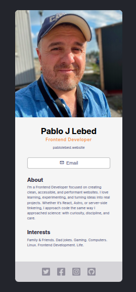

# Digital Business Card

A simple React-based digital business card built as part of the Scrimba Frontend Developer Career Path. This project serves as a hands-on exercise in component-based development, JSX, and basic styling.

🔗 **Live Demo**: [business-card.pablolebed.dev](https://business-card.pablolebed.dev)

## 📸 Preview

 <!-- Optional: Replace with actual screenshot if available -->

## 🧰 Tech Stack

- **React** (with Vite)
- **JavaScript (ES6+)**
- **CSS**
- **Deployed with Caddy on Ubuntu server**

## 📁 Project Structure

```bash
business-card/
├── public/ # Static assets (e.g. favicon)
├── src/
│ ├── components/ # Reusable React components
│ ├── App.jsx # Main App component
│ ├── index.css # Global styles
│ └── main.jsx # Entry point
├── .gitignore
├── index.html
├── package.json
├── README.md
└── vite.config.js
```

## 🚀 Setup & Development

If you'd like to run the project locally:

```bash
git clone https://github.com/your-username/business-card.git
cd business-card
npm install
npm run dev
```

Then open http://localhost:5173 in your browser.

## 📦 Build for Production

```bash
npm run build
```

## 🧑‍💻 Author

**Pablo Lebed**  
Frontend Developer in transition from Analytical Chemistry.  
[Portfolio](https://www.pablolebed.dev)  

## 📄 License
This project is open source and available under the MIT License.

-----------------------------------------
If you find this useful, feel free to star it or open an issue — even a hello goes a long way 😊
